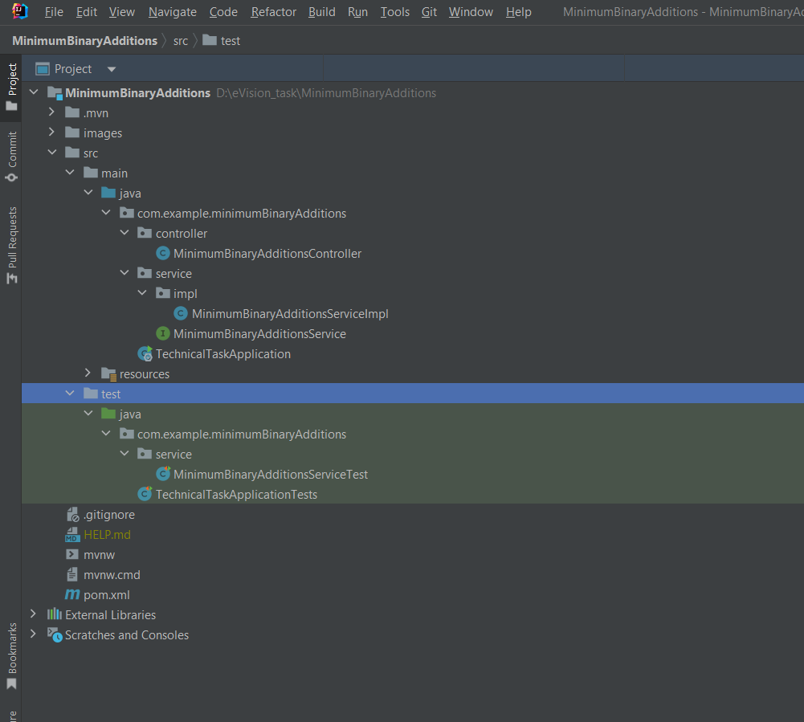
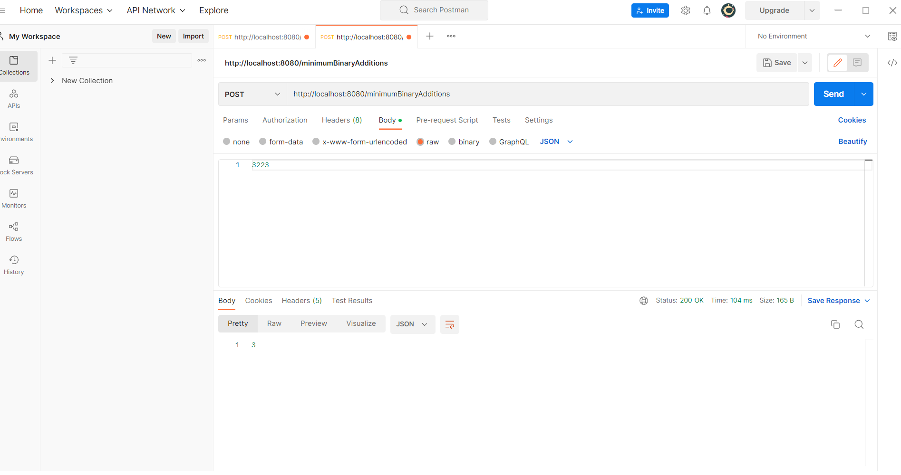
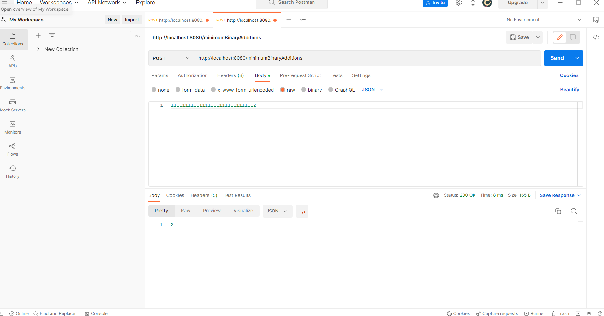
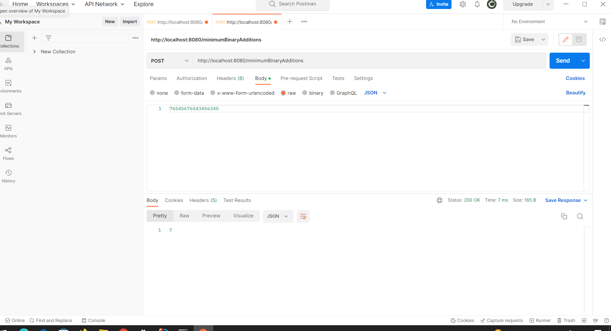

# Technical_task

a JAVA Spring Boot program that receives a string that represents a positive integer through a
post API, and returns in the response an integer that represents the minimum number of positive
integer numbers that each of their digits are either 1 or 0, needed to so that they sum up to the
positive integer represented by the received string.

## Architecture

* Controller : Contains the rest End Points of the project.
* Service: Service Class which have all the logic.
* test/service: which tests the logic of the program.

## Some Examples using PostMan

Exammple 1

Example 2

Example 3

